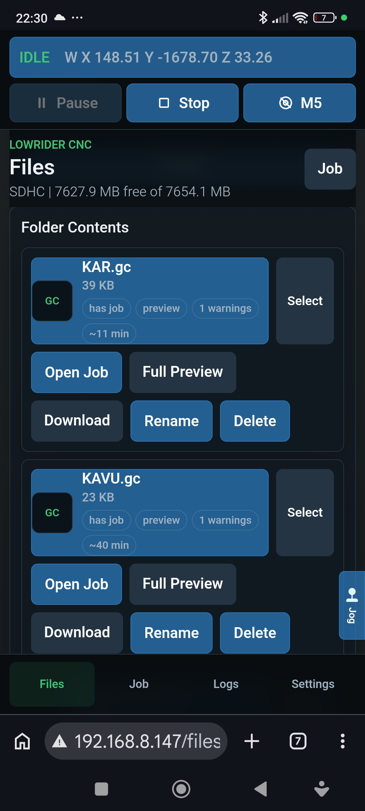
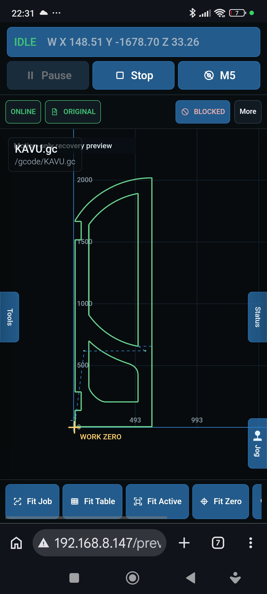
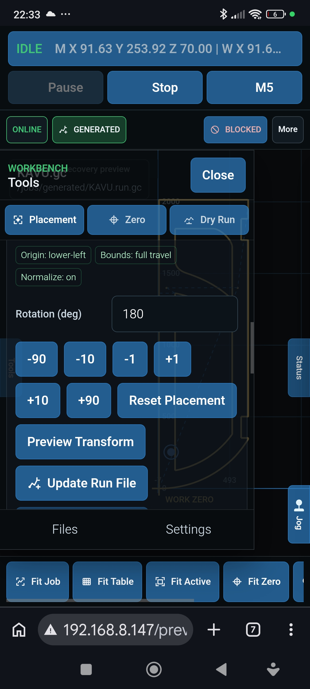
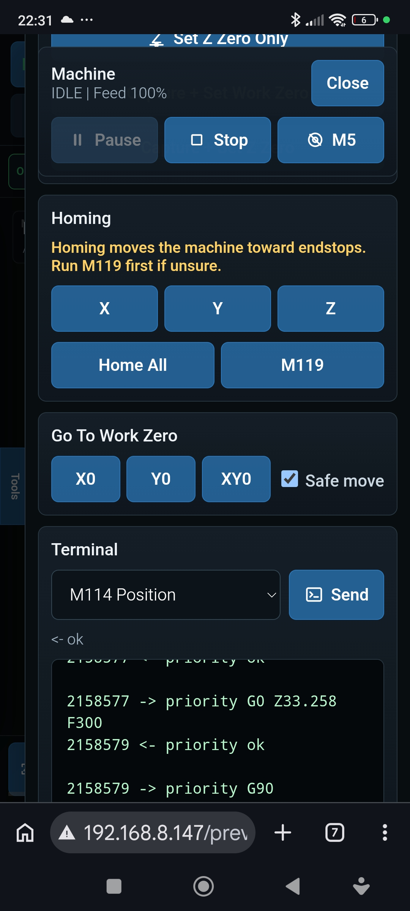
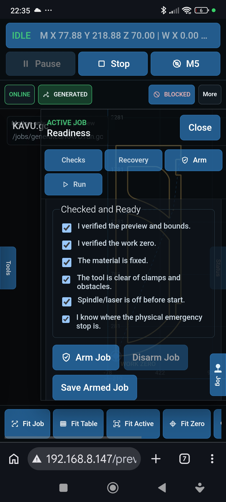
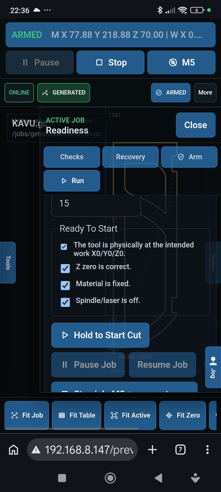
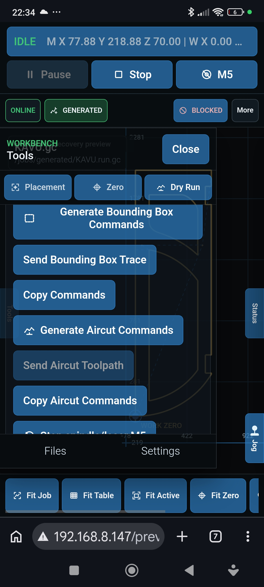
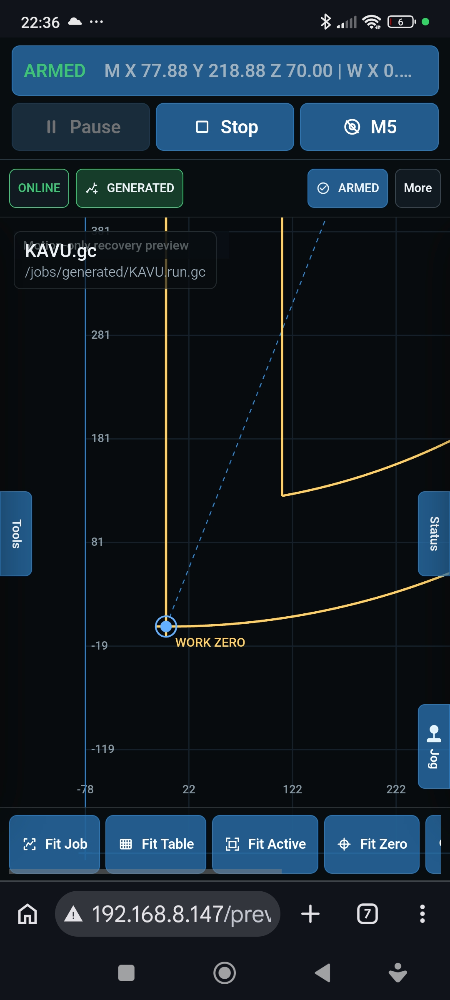

# LowRider CNC ESP32 Pendant

A phone-first, offline CNC workbench and web pendant for Marlin-based machines.

> Status: experimental DIY CNC controller companion. Use carefully and test without a cutting tool first.

This project turns an AI-Thinker ESP32-CAM into a local CNC companion for a LowRider CNC running Marlin on a BTT SKR Pro or similar controller. It combines a touch-friendly workbench, SD file management, G-code preview and placement, guarded setup and dry-run tools, and a firmware-owned streaming job runner.

Marlin remains the motion controller. The ESP32 owns serial communication, SD-streamed execution, priority controls, machine/work coordinate state, and browser-independent job progress. The primary UI is served from SD `/www`, so most interface updates do not require reflashing firmware.

The current setup is built around a LowRider CNC, BTT SKR Pro, and Marlin, but parts of it may be adaptable to other Marlin CNC machines.

## Screenshots

Representative phone screenshots from the current SD-hosted workbench:

| SD Files | Workbench Preview |
|---|---|
|  |  |

| Placement | Machine Controls |
|---|---|
|  |  |

| Readiness and Arming | Guarded Start |
|---|---|
|  |  |

| Dry Run | Work Zero and Live Position |
|---|---|
|  |  |

## Key Features

### Machine / Controller

- Marlin serial command bridge over UART.
- Health and status endpoints.
- Quick commands such as `M115`, `M114`, `M119`, `M5`, and `M400`.
- WiFi station mode with fallback setup AP.
- WebOTA firmware update.
- SD-card rescue firmware update.
- Firmware-backed safe analog jog with browser heartbeat timeout.
- Feedrate override using Marlin `M220 S<percent>`.
- Shared automatic XY travel speed with optional Marlin M203 limit detection.
- Cached Marlin hardware profile from M115, including 515DL full/work area and capabilities.
- Guarded Settings editors for M92/M203/M201/M204 with separate explicit M500 EEPROM persistence.
- Dedicated low-priority WebSocket telemetry that never blocks CNC streaming when a browser sleeps or disconnects.

### SD File Management

- Browse SD card folders.
- Upload, download, delete, rename, and create folders.
- File operations are restricted to approved roots.
- SD-hosted web UI from `/www`.
- G-code storage under `/gcode`.
- Job metadata storage under `/jobs`.

### G-code Preview

- Browser-side 2D XY preview.
- Persistent full-screen workbench with scalable machine grid, machine/work frames, work zero, and live tool position.
- Toolpath placement, rotation, normalization, and validated generated run files.
- Bounds calculation for X, Y, and Z.
- Feedrate parsing with min/max/count and effective feed range.
- Warning detection for units, coordinate mode, Z range, spindle commands, workspaces, and unsupported commands.
- Arc approximation for `G2` / `G3` using I/J center offsets.

### Job Workflow

- Job JSON sidecar files.
- Explicit work zero capture with `M400`, `M114`, and `G92 X0 Y0 Z0`, stored with machine-space identity.
- Tool / Z zero capture with `G92 Z0`.
- Preflight readiness checks.
- Bounding box dry run.
- Aircut toolpath dry run.
- Arm job workflow.
- Firmware-owned job start, monitor, pause, resume, and stop.
- SD-streamed execution without loading the complete G-code file into ESP32 RAM.
- Motion-only interruption recovery and guarded recovery planning; this is not automatic cutting resume.
- Feed override saved in job JSON and adjustable while running.
- FreeCAD-friendly `G54` handling.

### Safety / UI

- Mobile dashboard and bottom navigation.
- Persistent Machine Bar plus translucent Tools, Status, Job, and jog surfaces over the workbench.
- Always-accessible Pause, Stop, and M5 controls in the UI.
- Pause and Stop use priority firmware paths rather than normal file streaming.
- Dangerous setup actions such as homing and coordinate zero changes use confirmations.
- Software stop is not a physical emergency stop.

## Hardware

Known target hardware:

- AI-Thinker ESP32-CAM.
- microSD card in the ESP32-CAM.
- BTT SKR Pro v1.2 or similar Marlin controller.
- Marlin firmware on the CNC controller.
- UART serial connection between ESP32-CAM and the Marlin controller.
- External 5V buck converter recommended for ESP32-CAM power.
- Common ground between ESP32-CAM and CNC controller.

The camera is not initialized or used.

### Wiring

Current documented wiring uses ESP32-CAM UART0 and SKR Pro UART1:

| ESP32-CAM | CNC controller | Notes |
|---|---|---|
| GPIO1 / TX | RX1 | Serial to Marlin |
| GPIO3 / RX | TX1 | Serial from Marlin |
| GND | GND | Common ground required |
| 5V | 5V buck output | Do not power ESP32-CAM from a weak 3.3V rail |

Default serial baudrate is `250000`.

GPIO1 and GPIO3 are also normal USB/programming serial pins. If flashing fails, disconnect or isolate the CNC controller UART wiring while programming.

TODO: Document the exact SKR Pro Marlin serial port configuration used on the controller.

## Software Architecture

The core project rule is:

> Firmware is infrastructure. UI is content.

The ESP32 firmware owns hardware access, WiFi setup, HTTP and WebSocket services, SD access, firmware update paths, Marlin serial I/O, machine/work coordinate state, job streaming, priority controls, and safe jog timing.

The mobile app UI is content served from the SD card. The primary UI files live under `/www` on the ESP32 SD card and can be updated without flashing firmware.

```text
Phone browser
   -> HTTP APIs and SD assets
   -> event-driven WebSocket telemetry
ESP32-CAM
   -> isolated low-priority browser transport
   -> firmware-owned SD job runner and priority controls
   -> UART serial
Marlin controller
   -> stepper drivers
CNC machine
```

Main runtime SD folders:

```text
/www       web UI
/gcode     CNC files
/jobs      job JSON sidecars
/firmware  optional update files
/logs      logs
```

Firmware changes should normally be limited to APIs, hardware behavior, serial/job runner behavior, recovery, or security. UI changes should usually be made by replacing files in SD `/www`.

## Directory Layout

```text
/
|-- src/                  # ESP32 firmware
|-- data/                 # SPIFFS fallback web assets
|-- www/                  # SD-hosted mobile web UI source files
|-- docs/                 # architecture, protocol, wiring, setup notes
|-- work/                 # development task notes and handoff
|-- platformio.ini        # PlatformIO config
|-- AGENTS.md             # project instructions for coding agents
`-- README.md
```

## Getting Started

### 1. Clone and Open

Clone the repository and open it in VS Code with PlatformIO installed.

```powershell
git clone <repo-url>
cd CNC-ESP32
```

### 2. Build Firmware

```powershell
pio run
```

If `pio` is not on PATH, use PlatformIO from the VS Code-managed environment or run the command from the PlatformIO terminal.

### 3. Flash ESP32-CAM

The project is configured for:

- `board = esp32cam`
- `framework = arduino`
- `upload_port = COM5`
- `monitor_port = COM5`
- `monitor_speed = 250000`
- OTA-capable partition layout: `min_spiffs.csv`

Flash:

```powershell
pio run --target upload
```

If flashing fails, disconnect the SKR Pro UART connection from ESP32-CAM GPIO1/GPIO3 while programming.

### 4. Prepare SD Card

The firmware creates these folders when SD is mounted, but it is safe to create them manually:

```text
/www
/gcode
/jobs
/firmware
/logs
```

Copy the files from repo `www/` to SD `/www`.

### 5. Connect to Marlin

Connect ESP32-CAM UART0 to the CNC controller UART as documented in the wiring section.

Make sure the ESP32-CAM has stable 5V power from an external buck converter and shares ground with the controller.

### 6. Open the Web UI

On boot, the ESP32 tries saved WiFi credentials. If it cannot connect within about 15 seconds, it starts the fallback AP:

| Setting | Value |
|---|---|
| SSID | `LowRider-CNC-Setup` |
| Password | `12345678` |
| Default AP address | `192.168.4.1` |

Open the shown local IP or `http://192.168.4.1` in a phone browser when using fallback AP mode.

## Typical Workflow

1. Upload a G-code file to `/gcode`.
2. Open the file from the Files page.
3. Preview the toolpath.
4. Check bounds, units, coordinate mode, Z range, and warnings.
5. Jog or move the machine to the intended work zero.
6. Capture and set work zero.
7. Set Tool / Z zero if needed.
8. Save the job JSON sidecar under `/jobs`.
9. Run Preflight.
10. Run a bounding box trace or aircut dry run.
11. Arm the job.
12. Hold the guarded Start control to begin with the saved active work zero.
13. While running, use Pause, Stop, M5, status, and feed override as needed.

### FreeCAD, G54, and Work Zero

FreeCAD Path commonly outputs `G54`. This project treats `G54` as the normal default workspace.

Work zero is set deliberately during setup and stored with its machine-space identity. Normal Start uses that already-active coordinate frame; it does not redefine zero with `G92` during the start sequence.

The firmware prepares the job with commands equivalent to:

```text
M5
G21
G90
G54
M220 S<startPercent>
M400
M114
```

Start is blocked if the saved work zero, homing epoch, active run path, or active run fingerprint no longer matches the reviewed job. This prevents an armed job from silently falling back to machine/home origin or to a different source file.

Non-default workspaces such as `G55` and above are treated as advanced / multi-fixture use and are blocked unless the job JSON explicitly allows them.

## Job JSON

Each G-code file can have a sidecar job file under `/jobs`, for example:

```text
/gcode/example.gc
/jobs/example.gc.job.json
```

Job JSON stores preview metadata, machine-space work-zero identity, dry-run status, arming information, workspace behavior, and feed override settings.

Example:

```json
{
  "schemaVersion": 2,
  "gcodePath": "/gcode/example.gc",
  "jobPath": "/jobs/example.gc.job.json",
  "startMode": "use_active_work_zero",
  "allowedWorkspaceCommands": false,
  "preview": {
    "bounds": {
      "xMin": 0,
      "xMax": 100,
      "yMin": 0,
      "yMax": 100,
      "zMin": -3,
      "zMax": 10
    },
    "lineCount": 123,
    "segmentCount": 45
  },
  "workZero": {
    "method": "G92 X0 Y0 Z0"
  },
  "toolZero": {
    "method": "G92 Z0"
  },
  "dryRun": {
    "safeZ": 15,
    "margin": 0
  },
  "feedOverride": {
    "startPercent": 100,
    "lastUsedPercent": null,
    "resetTo100AfterJob": true,
    "updatedAt": null,
    "source": "user"
  }
}
```

TODO: Add a formal versioned JSON schema once the job metadata stabilizes.

## Safety Notes

This project is not a certified industrial safety system. It is a DIY controller companion.

- Software stop is not a physical emergency stop.
- Browser, WiFi, firmware, serial communication, or the CNC controller can fail.
- The firmware job runner must continue independently if the browser sleeps or disconnects; loss of UI visibility is still a reason to supervise the physical machine closely.
- Keep a real physical emergency stop or power cut available.
- M5 only turns off spindle/laser output if Marlin and the machine wiring support it.
- Mechanical emergency stop behavior depends on your machine wiring and controller configuration.
- Homing moves the machine toward endstops.
- `G92` changes the active coordinate zero.
- Feed override changes movement speed only; it does not change router RPM.
- Do not trust the preview alone.
- Always test new jobs in air first.
- Keep your hand near the physical emergency stop during setup and testing.
- Do not run unattended.

## API Overview

Main routes currently documented or implemented:

| Route | Purpose |
|---|---|
| `GET /api/health` | Firmware, uptime, WiFi, SD, memory, and build status |
| `POST /api/cmd` | Send a single Marlin command |
| `GET /api/sd/status` | SD card status and capacity |
| `GET /api/files?path=/gcode` | List SD files |
| `GET /api/download?path=...` | Download SD file |
| `POST /api/upload` | Upload SD file |
| `POST /api/delete` | Delete SD file or empty folder |
| `POST /api/mkdir` | Create folder |
| `POST /api/rename` | Rename file or folder |
| `GET /api/job/status` | Job runner status |
| `POST /api/job/start` | Start an armed job |
| `POST /api/job/pause` | Pause active job through priority controls |
| `POST /api/job/resume` | Resume paused job |
| `POST /api/job/stop` | Stop active job through priority controls |
| `POST /api/job/feed-override` | Send Marlin `M220 S<percent>` |
| `POST /api/test-motion/start` | Start a validated firmware-owned Aircut/Toolless stream |
| `POST /api/jog/start` | Start firmware-owned safe jog |
| `POST /api/jog/update` | Jog heartbeat/vector update |
| `POST /api/jog/stop` | Stop jog |
| `GET /api/jog/status` | Jog status |
| `POST /api/work-zero/goto` | Bounded X0/Y0/XY0 move with optional Safe Z lift |
| `POST /api/work-zero/restore` | Restore saved XY work zero after Home All |
| `GET /wifi` | WiFi settings page |
| `POST /api/wifi/save` | Save WiFi credentials |
| `POST /api/wifi/forget` | Forget WiFi credentials |
| `GET /update` | WebOTA upload page |
| `POST /api/update` | WebOTA firmware upload |

See `docs/protocol.md` for more detail.

## Firmware Updates

### WebOTA

Use `/update` when the device is reachable over WiFi. Upload the PlatformIO-built `firmware.bin`.

Do not update while the CNC is moving or cutting.

### SD Rescue Update

If WiFi or the UI is broken, copy firmware to:

```text
/firmware/update.bin
```

Then create:

```text
/firmware/INSTALL.NOW
```

Reboot the ESP32-CAM. The firmware only starts the rescue update when both files exist.

Do not rely on a root-level `firmware.bin`; it is ignored.

## Roadmap

### Implemented

- WiFi station mode with fallback setup AP.
- SD-hosted mobile UI under `/www`.
- SD file manager.
- Browser-side G-code preview.
- Job JSON sidecar workflow.
- Work zero and Tool / Z zero capture.
- Preflight checks.
- Bounding box and aircut dry runs.
- Firmware-owned validated Aircut/Toolless streaming with native G2/G3 arcs.
- Arm job flow.
- Firmware-owned job runner.
- SD-streamed G-code execution with one bounded line in ESP32 RAM; browser preview/transform size
  warnings are separate and do not limit normal execution.
- Priority Pause, Stop, and M5 behavior.
- Feed override using `M220`.
- Firmware-backed safe analog jog with deadman timeout.
- WebOTA update.
- SD rescue firmware update.

### In Progress

- Hardening job runner behavior and browser safety UI based on real machine testing.
- Improving documentation and handoff notes as behavior changes.
- Motion-only recovery, Toolless Resume Test, and a guarded two-phase Production Resume foundation.
  Production Phase 2 is firmware-owned and still requires manual router verification.

### Planned / Ideas

- More robust priority command handling and serial response handling.
- More robust JSON parsing in firmware.
- Power-loss recovery, durable on-device history, richer modal reconstruction, and lead-in
  strategy after interruptions.
- Multi-fixture / multiple work area support.
- HTTPS or stronger protection for sensitive routes.
- Authentication before exposing beyond a private local network.
- Optional cloud sync / SaaS integration.
- Camera support, if it becomes useful and safe.
- Gamepad support.
- More detailed job history and run logs.

## Development Notes

### Local UI And Workflow Simulation

Run the complete SD-hosted UI against a desktop mock ESP32/Marlin backend:

```powershell
npm install
npm run dev:mock
```

Open `http://localhost:8097`, or use the printed `LAN:` address from a device on the same trusted
private network. Local pages show `DEV MOCK - NO REAL MACHINE` in the Machine Bar.
The mock provides persistent SD files, sample G-code, Marlin commands, active-run validation, job
streaming, Pause/Stop/M5, and feed override without opening a serial port.

The mock LAN server has no authentication. Do not expose port 8097 to the internet or an untrusted
network.

Reset local state with:

```powershell
npm run dev:mock:reset
```

See [docs/mock-dev-server.md](docs/mock-dev-server.md) for supported APIs, samples, safety checks,
and limitations.

- Use PlatformIO with `board = esp32cam` and `framework = arduino`.
- Keep the camera disabled unless explicitly adding camera functionality.
- Keep the primary UI updateable from SD `/www`.
- Prefer firmware changes only for APIs, hardware behavior, serial/job runner behavior, recovery, or security.
- Update `docs/` and `work/` notes when changing behavior.
- Keep changes small and test on the machine without a cutting tool first.

## License

This project is licensed under the MIT License. See [LICENSE](LICENSE) for details.

The MIT License is a software license and does not provide CNC safety protection. This is an experimental DIY CNC controller companion. It does not replace a physical emergency stop. Use at your own risk.
