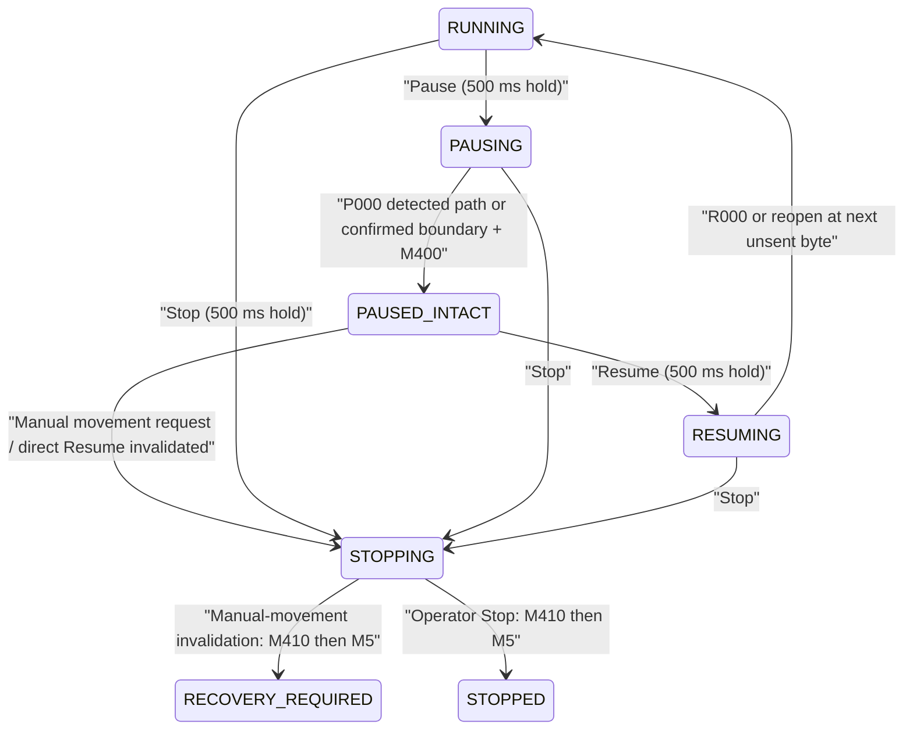

# Architecture

## Goal

This firmware turns an AI-Thinker ESP32-CAM into an offline CNC web pendant for Marlin.

The ESP32-CAM connects to saved WiFi credentials when available. If it cannot connect within
15 seconds, it starts a setup access point named `G-code-CNC-Setup` at `192.168.4.1`. It serves
a small web UI and forwards one command at a time to Marlin over UART0.

## Architecture rule

Firmware is infrastructure. UI is content.
Prefer changing /www files on SD card for UI features.
Modify firmware only for new APIs, hardware access, protocol handling, OTA/recovery, or security.
The primary app UI is SD-hosted under `/www`; firmware is only changed for APIs, hardware behavior,
or job runner functionality.

## G-code memory ownership

- Job execution is SD-streamed by firmware. The runner opens `File`, reads one bounded line, sends
  it to Marlin, waits for `ok`, and then reads the next line. Normal execution never loads the full
  G-code file into ESP32 RAM.
- Browser preview and transform are content tools with their own memory profile. They may warn or
  limit visual processing independently, but those limits must not become firmware execution
  limits or silently alter the selected execution file.
- The current UI gives soft warnings above 2 MiB for transform and 4 MiB for preview. These warnings
  do not block original-file execution.
- Validated temporary Aircut, Toolless, and Production Resume streams have a separate 2 MiB safety
  cap. Firmware still validates them incrementally from SD and reopens the file for streaming.

## Job hold and interruption state machine

`PAUSED` is reserved for the separate M6 tool-change confirmation flow. `PAUSED_INTACT` never
implies cutter shutdown; the operator UI must say that the cutter remains running.

## MVP Components

- WiFi station mode with setup AP fallback.
- WiFi credential storage in Preferences/NVS namespace `wifi`.
- Device identity from `/esp32-cnc/config.json`, with `/config.json`, NVS namespace `device`, and
  `cnc` / `ESP32 CNC` defaults as ordered fallbacks.
- mDNS discovery at `http://<hostname>.local`, advertising HTTP and `_esp32cnc._tcp` on port 80.
- Optional low-frequency, non-connectable BLE naming started after the web stack; WiFi reliability
  and CNC control take priority over BLE discovery.
- HTTP server for static assets and JSON API routes.
- Static browser UI:
  - `index.html`
  - `app.js`
  - `style.css`
- UART command bridge to Marlin:
  - UART0 is Marlin-exclusive. Framework and application diagnostics must never be written to it.
  - Send command plus newline.
  - Wait up to 1500 ms.
  - Collect the response.
  - Return the response as JSON.
- Web OTA update route:
  - Browser form at `/update`.
  - Firmware upload endpoint at `/api/update`.
  - Sends `M5` and `M400` before accepting firmware data.
- SD rescue update:
  - Automatically installs root `/firmware.bin` and renames it to `/firmware.done.bin` on success.
  - Checks `/firmware/update.bin` and `/firmware/INSTALL.NOW` before WiFi starts.
  - Streams firmware from SD with Arduino `Update`.
  - Logs to `/logs/update.log`.
- SD file manager:
  - Browser page at `/files`.
  - JSON file APIs under `/api/files`, `/api/upload`, `/api/download`, `/api/delete`,
    `/api/mkdir`, and `/api/rename`.
  - Restricts operations to `/gcode`, `/www`, `/firmware`, `/jobs`, and `/logs`.
- SD-hosted UI:
  - Serves `/www/index.html` from SD for `/` when present.
  - Serves `/www/app.js`, `/www/style.css`, `/www/files.html`, `/www/files.js`, and other safe
    `/www` assets when present.
  - Falls back to built-in SPIFFS UI files when SD UI files are missing.
- CNC job runner:
  - Starts only from an ARMED job JSON under `/jobs`.
  - Streams a selected G-code file from `/gcode` on the ESP32 SD card to Marlin over UART.
  - Runs in `loop()` with one command in flight and waits for Marlin `ok` before sending the next
    cleaned line.
  - Provides start, status, pause, resume, and stop API endpoints for the browser UI.
  - Keeps normal file streaming separate from stateful Pause/Resume, urgent Stop, and feed
    override controls.
  - Models ordinary holds as `RUNNING -> PAUSING -> PAUSED_INTACT -> RESUMING -> RUNNING`.
    Explicitly detected Marlin realtime reporting uses `P000/R000`; otherwise Pause waits for the
    current command and `M400` boundary without segmenting source G-code.
  - Any manual-movement request from `PAUSED_INTACT` invalidates direct Resume before movement,
    persists recovery evidence, executes `M410` then `M5`, clears frame trust, and enters
    `RECOVERY_REQUIRED`.
  - Standalone `M5` is Advanced Manual only and is rejected throughout active, intact-paused,
    resumable, stopping, and recovery states.
  - Captures recent Marlin commands/responses in a bounded log for global UI visibility.
  - Scans safety-critical job metadata with a bounded streaming window, so ARMED and active-run
    checks do not fail when run history grows the JSON beyond an earlier snippet size.
- Full-duplex WebSocket transport (Phase 1):
  - Historical Phase 1 kept machine commands (Home, Zero, Pause, Resume, Stop, Start, Bounding Box,
    Jog) on HTTP while migrating authoritative state and synchronization.
  - Carries authoritative live state, synchronization, monotonic packet sequencing, piggybacked ACKs, and ESP boot identity.
  - Establishes a controller-independent state schema normalizing system, controller, machine, job, jog, and control states.
  - Maintains separate monotonic uptime time (for motion/timeouts) and browser-synchronized wall-clock time (for file/log metadata).
  - Throttles broadcasts to at most 10 Hz and falls back to sparse HTTP polling when disconnected.
  - Batches compact motion-command events for browser-side animation instead of broadcasting full
    job status for every send/ack transition; full progress is limited to 2 Hz.
  - Uses Marlin M154 only while a visible telemetry client exists: 1 second during motion, 2
    seconds while idle, and disabled when no client remains.
  - Position reports are change-filtered with a 0.001 mm tolerance threshold. Predictive animation is deliberately not corrected by
    reported-position error in this phase.
  - Preview preserves each parsed segment's streamed command number. Motion deltas animate the
    commanded segment immediately using its retained length and feed, while `M154 S1` reports update
    the authoritative machine frame.
  - If WebSocket telemetry is unavailable, sparse job-status polling deduplicates by command number
    and starts the same animation; this is delayed but smooth rather than a point-to-point jump.
  - The main Arduino loop (Core 1) never calls WebSocket library functions (`telemetrySocket.loop()`, `sendTXT`, `broadcastTXT`).
  - Top-level state slices (`system`, `controller`, `machine`, `job`, `jog`, `control`) use thread-safe latest-value replacement under a FreeRTOS mutex (`telemetryStateMutex`). State producers serialize updated JSON slices into staged state without blocking.
  - A dedicated low-priority network task (`telemetryNetworkTask`) pinned to Core 0 exclusively owns `telemetrySocket.loop()`, WebSocket callbacks (`handleTelemetrySocket`), client protocol sequencing, and socket sends.
  - Motion animation events and Marlin log entries use bounded, non-blocking FreeRTOS queues (`motionEventQueue`, `logEventQueue`) sent with zero wait time (`xQueueSend(..., 0)`).
  - Queue saturation increments drop counters (`motionTelemetryDropped`, `logTelemetryDropped`) without applying backpressure or blocking SD/UART streaming or Jog.
  - During a long streamed G2/G3 command, complete M154 position lines are parsed as they arrive;
    firmware does not wait for the motion command's final `ok` before publishing position changes.
- Authenticated WebSocket commands (Phase 3 current state):
  - Stop, Pause, Resume, feed override, Home, Work Zero, and Z Zero use the bounded authenticated command transport; their
    existing operator-protected HTTP routes remain. Job Start, Bounding Box, Jog, and other
    actions remain HTTP/unmigrated.
  - Home / Work Zero / Z Zero execute as cooperative machine operations: admission happens inside
    `processWsCommandQueue()`, but the Marlin transaction advances one step per `loop()` tick in
    the machine-operation engine (`admitMachineOperation` / `processMachineOperation` /
    `completeMachineOperation`), which holds the OrdinarySync controller-communication
    transaction for its whole duration. The loop never blocks for a machine command, so HTTP
    heartbeats, `safety.stop` execution, job/jog runners, and telemetry staging stay responsive.
  - `safety.stop` cancels an active machine operation (`ABORTED_BY_STOP`) and fires the M410/M5
    quickstop from any job state; interrupted homing never publishes a trusted frame. The legacy
    HTTP routes run the same engine synchronously to preserve their documented envelopes — the
    only remaining long-blocking HTTP paths, isolated to the legacy transport.
  - Job Start (Phase 3D) stays in the Job Runner rather than the machine-operation engine:
    `admitJobStart` is the shared admission core for the WS action and the HTTP route, and the
    start preamble remains the existing priority-command sequence advanced one step per loop()
    tick through `PREPARING`. The WS command binds at admission and its terminal result is
    published from the preparation lifecycle (RUNNING / failure / Stop preemption) with an
    exactly-once guard; the checkpoint-before-motion invariant is preserved inside admission.
  - The browser sends `command`/`commandQuery` with control-session epoch, ephemeral token, command
    identity, and insertion-order serialized payload identity. Firmware uses an 8-entry execution
    queue and 32-entry session ledger; reconnect queries recover results within the same session.
  - Immediate `commandAck`/`commandResult` packets are unsequenced. Normal sequenced authoritative
    state patches remain the success authority.
  - Stop dispatches WebSocket and protected HTTP immediately and redundantly, then waits for newer
    canonical job telemetry. It is not a physical E-stop; during communication loss controller
    receipt is explicitly unconfirmed.
  - Applied feed changes only after the exact queued M220 receives terminal success. Failure retains
    the prior `feedOverridePercent` and publishes command/response/error diagnostics.
  - Jog is not suitable for the generic command queue; its future migration requires a separate
    coalesced realtime transport design.
- Safe analog jog:
  - Browser sends joystick intent and heartbeat updates only.
  - ESP32 firmware owns the jog state machine, safe Z lift, 50 ms relative movement ticks, and
    500 ms deadman timeout.
  - Every active project derives one work-coordinate Safe Z from stock geometry:
    `stockTopWorkZ + safeZClearanceMm`. Top-referenced stock has a top at Z0, bottom-referenced
    stock has a top at its workpiece height, and custom reference stores the explicit stock-top Z.
  - Browser job start, bounds, Aircut, Safe Jog, Work Zero return, Toolless Resume, and production
    recovery all consume that same derived value. Firmware reloads the Job JSON, recomputes it, and
    rejects mismatches or physically unreachable targets instead of clamping.
  - Safe Jog mode captures current Z, sends `M5`, converts the project work-coordinate Safe Z
    through the active Work Zero to an absolute `G53` machine target, and restores the captured Z
    after jogging stops if Z was not changed.
  - The machine-level Safe Z setting is available only as an explicit manual-jog fallback when no
    project is active; it is never copied into project metadata.
  - Browser requests update only the desired velocity vector. Firmware keeps at most three short
    movement ticks queued, tracks each Marlin acknowledgement, and restores `G90` on every stop.
  - The XY speed slider sets the maximum feedrate; joystick distance from center sets each tick's
    movement length and the firmware scales feedrate so partial stick movement remains smooth.
- Shared automatic travel speed:
  - Browser settings store a 10–100 mm/s XY travel speed, default 50 mm/s.
  - Bounding box, aircut rapid, recovery, work-zero travel, and job-start modal G0 use this value.
  - Z safety moves stay at a separate conservative 400 mm/min.
  - Settings may parse Marlin M503/M203 to narrow the UI maximum to the slower X/Y axis.
- Validated test-motion streaming:
  - Aircut and Toolless Resume generate temporary files under `/jobs/generated`.
  - The browser uploads once and starts `/api/test-motion/start`; it does not send one HTTP request
    per movement command.
  - Firmware validates the whole file, then revalidates each command while the existing SD/UART
    runner streams one command per Marlin `ok`.
  - Native G2/G3 I/J arcs are retained, allowing Marlin's planner to execute continuous curves.
  - Existing stateful Pause/Resume and urgent Stop behavior remains above the test-motion stream.
- WiFi settings route:
  - Browser form at `/wifi`.
  - Save endpoint at `/api/wifi/save`.
  - Forget endpoint at `/api/wifi/forget`.
- Machine profile discovery:
  - Loads the last valid profile from Preferences namespace `machine` during boot.
  - Schedules one idle-only, non-blocking `M115` read after Marlin startup.
  - Parses 515DL `area.full` / `area.work`, identity, and selected capabilities.
  - Safety-critical `EMERGENCY_PARSER` and realtime-hold flags are evidence from M115 in the current
    controller communication session only. They are never trusted from NVS and are invalidated on
    communication loss or recovery until a fresh M115 probe succeeds.
  - Controller health transitions (`connected` / `unresponsive` / `recovering` / restored) are
    written to `/logs/system.log` when the state changes, with the failing command and error; the
    routine `waiting` window of a single synchronous command is not logged.
  - Uses `area.full` for Preview and guarded restore/resume bounds; falls back to compiled defaults.
  - Settings reads `M503` and `M211` on demand. Editable M92/M203/M201/M204 changes apply to
  Marlin RAM only; `M500` persistence is always a separate explicit action.
- Coordinate-frame ownership:
  - Firmware owns homing and XYZ work-zero transitions.
  - `machine` coordinates remain tied to the physical Home All session; `work` coordinates are the
    active G54/G92 coordinates; `workZeroMachine` maps G-code origin onto the physical table.
  - Full homing creates a new `homingEpoch`. Saved job zeros from another epoch are not silently
    reused.
  - Normal Start Job never sends G92. It verifies the armed work-zero ID, epoch, and machine-space
    origin before streaming.
  - Position telemetry publishes changed frame state only; browser motion prediction updates both
    work and machine display while periodic Marlin reports remain authoritative.
  - Home All records Marlin `Count X/Y/Z` and current `M92` steps/mm. Machine coordinates are then
    derived directly from those immutable home counts, never by adding the latest work coordinate
    to a previous G92 zero.
  - Every Home All receives a boot-unique `homingSessionId`; an epoch number reused after ESP
    restart cannot make an old zero appear active accidentally.
  - Recovery bounds convert every file/work point to physical machine space with
    `machine = savedWorkZeroMachine + work` before checking discovered limits.
- Asynchronous job start:
  - `POST /api/job/start` validates and opens the armed run, queues the Marlin start preamble, and
    returns `PREPARING` immediately.
  - The main loop advances the preamble one acknowledged command at a time. It changes to `RUNNING`
    only after the entire preamble succeeds, so no file line is streamed during `PREPARING`.
  - A Marlin error or timeout closes the run file and changes the job to `ERROR`.

## Explicitly Out Of Scope

- Camera initialization or streaming.
- G-code preview.
- Job resume.
- Additional WebSocket command migrations, including Job Start, Bounding Box, and Jog.

Physical ESP32-CAM/Marlin hardware has not been exercised for the current Phase 3 command transport.
